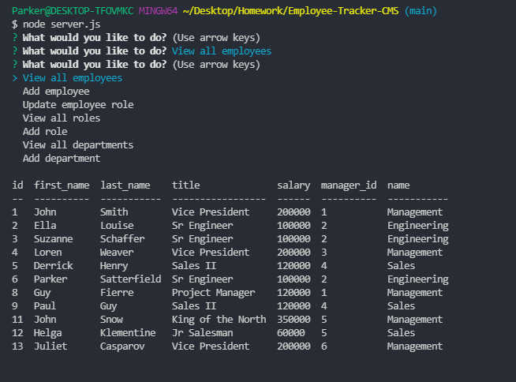

# **Employee Tracker CMS**

### *This is an employee tracking CMS command-line app. Using Node to connect the user interface to the backend, this app uses inquirer to communicate with the user and mysql2 to send data to the database using JS. It includes an SQL database named employees_db.* 

## [](https://opensource.org/licenses/Apache-2.0) 

## Mock Up
  

Video Link: https://drive.google.com/file/d/1iSejSF9RmT-exOd424sfp4wRyfH9hTJW/view?usp=sharing

## Table of Contents 

1. [Installation](#installation)

2. [Usage](#usage)

3. [Contributing](#contributing)

4. [Test](#test)

5. [Questions](#questions)

## Installation 

1. Download the app from my repo.
2. Run npm i to install all required packages (inquirer, mysql2, and console.table).
```
npm i
```
3. Run command 
```
node server.js
```

## Usage 

Use this app to track employees, salaries, roles, and departments within a company.

## Contributing 

None 

## Test 

This application has no tests.

## Questions 

Email: parkers205@gmail.com 

GitHub: https://github.com/parkersatterfield 

---

## License Information 
APACHE 2.0 (Not really, I am just showing of my README generator app).

            